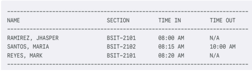

<h1 align = "center">E-ONE QUEUE</h1>
<h3 align = "center">CICS ACADEMIC ATTENDANCE PORTAL – SYSTEM OVERVIEW.</h3>
<p align = "center">
<b></b> <br/>
<b>IT 2109 </b> <br/>
<b></b> <br/>
Arevalo, John Paul <br/>
Malaluan, Aaron <br/>
Ramirez, Jhasper
</p>

--------------------------------------------------------------------------------
## 📖 Overview
The CICS Academic Attendance Portal is a console-based Java program designed for
2nd Year IT students. It allows students to log their attendance per subject, while
professors can view and filter attendance records. The system demonstrates strict OOP
principles and is built to showcase encapsulation, inheritance, polymorphism, and
abstraction using a structured, modular approach. The application also implements error
handling and formatted input validation.

--------------------------------------------------------------------------------
### Users can:
- **Choose a Subject:** Select the specific class they are attending (like "Discrete
Math" or "OOP") from a numbered list.<br/>

- **Time In:** Type their name, section, and arrival time (e.g., "08:00 AM") to mark
themselves as present.<br/>

- **Time Out:** Update their record by typing their name and the time they are leaving
(e.g., "10:00 AM")<br/>

- **Check Their History:** Search for their own name to see if their attendance was
saved correctly.

--------------------------------------------------------------------------------
### Professors can:
- **Log In:** Enter a secret password (cics2025) to access the teacher's menu

- **View the Whole List:** Select a subject to see a complete list of every student
who attended that class.

- **Check for Absences:** Easily see if a student is still in class or forgot to sign out
by looking for "N/A" in the list.

## 💾 Data Storage Currently 
all entries are stored in Volatile Memory (RAM) using a
Student[] array. Note: Data resets when the application closes.

### ⚙️ System Purpose
The goal of this system is to stop using paper attendance sheets and use a computer
instead. It helps students quickly record the exact time they enter the class and when
they go home. A big part of the goal is to keep the list clean by forcing everyone to type
their names in capital letters. This stops the teacher from struggling to read bad
handwriting. It also keeps the records safe so that the attendance list never gets
lost.zThe teacher can easily check who is in class just by typing a simple password.
Overall, it is meant to make daily attendance faster and perfectly organized.

### 📜 Features 
**For the students:**
- Log Time In: You can record the exact time you arrive at class.
- Log Time Out: You can record the time you leave so the teacher knows you
stayed for the whole class.
- Personal History: You can search for your own name to double-check that your
attendance was saved correctly.
- Format Checker: The system stops you from making mistakes by forcing you to
type in CAPITAL LETTERS.

--------------------------------------------------------------------------------
**For Professors:**
- **Password Protection:** The teacher's menu is locked with a password
(cics2025) so students cannot mess with the records.
- **Class View:** The teacher can see a full list of every student who attended a
specific subject.
- **Missing Log Detection:** The teacher can easily see "N/A" next to a name if a
student forgot to sign out.

--------------------------------------------------------------------------------
## Project Structure
```
📂 oop-proj
└── 📂 src/attenanceTracker
    └── AttendanceAction.class       
    └── Main.Class
    └── Main.java
    └── Professor.class
    └── SchoolMember.class
    └── Student.class
```
- `Main.java` - Entry point of the program, containing the menu and handles user interactions.
- `Main.class` - Compilation file of Main class
- `Professor.class` - Compilation file of Professor class
- `SchoolMember.class` - Compilation file of SchoolMember class
- `Student.class` - Compilation file of Student class
- `AttendanceAction.class` - Compilation file of AttendanceAction class

--------------------------------------------------------------------------------
### 💊 ENCAPSULATION
Encapsulation was applied by making variables like name, section,
and timeInRecord private inside the Student class. These can only be accessed or
changed using public methods (Getters).

--------------------------------------------------------------------------------
### 💡 ABSTRACTION
Abstraction was implemented using the SchoolMember abstract class. It
defines that every user has a name, but it doesn't say how they use the portal. It also
uses the AttendanceActions interface to force the Student class to have timeIn()
and timeOut() methods.

This hides the complex details and just shows what the object does.

--------------------------------------------------------------------------------
### 🧬 INHERITANCE
Inheritance is the core structure. Student and Professor both extend
(inherit from) SchoolMember.

This means we didn't have to write the code for "Name" and "Role" twice. They both got
it automatically from the parent class.

--------------------------------------------------------------------------------
### 🎭 POLYMORPHISM
The method showPortal() demonstrates polymorphism. Both the
Student and Professor have this method, but they behave differently.
- If the user is a Student, showPortal shows the logging menu.
- If the user is a Professor, showPortal shows the viewing list.

The main program calls the same method name, but the result changes based on who
is using it.

### Example Output:
<tr>
    <td> </td>
    </td>
</tr>

### Summary of Input data:
<tr>
    <td> </td>
    </td>
</tr>

